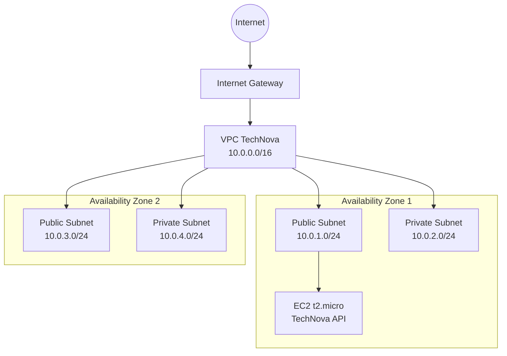

# TechNova - Infraestrutura AWS com Terraform

## Aluno

* **Nome:** Renan Dias
* **RA:** 6325033
* **Data:** 15/09/2026

---

## Sobre o projeto

Este projeto apresenta a criação de uma infraestrutura na AWS utilizando **Terraform**, com foco em conceitos de redes, alta disponibilidade entre Availability Zones, Security Groups e provisionamento de uma instância EC2 utilizando User Data.

A infraestrutura foi desenvolvida no ambiente **AWS Academy Learner Lab**.

---

## Arquitetura

A infraestrutura utiliza uma VPC com CIDR `10.0.0.0/16`, distribuída em duas Availability Zones.

Cada Availability Zone possui uma subnet pública e uma subnet privada.



### Componentes da arquitetura

* 1 VPC: `10.0.0.0/16`
* 2 subnets públicas
* 2 subnets privadas
* 2 Availability Zones
* 1 Internet Gateway
* 1 tabela de rotas pública
* Subnets privadas utilizando a tabela de rotas padrão
* 1 Security Group para a API
* 1 Security Group reservado para o banco de dados
* 1 instância EC2 `t2.micro`
* API Node.js/Express executando na porta `3000`

---

## Estrutura do projeto

```text
aula-04/
├── .gitignore
├── providers.tf
├── main.tf
├── variables.tf
├── outputs.tf
├── key_pair.tf
├── user_data.sh
├── evidencia-plan.txt
├── terraform-plan-output.txt
├── evidencia-api.json
├── evidencia-ssh.txt
├── .terraform.lock.hcl
└── README.md
```

---

## Pré-requisitos

Para executar o projeto, são necessários:

* AWS CLI configurado com as credenciais do AWS Academy Learner Lab
* Terraform instalado
* Acesso ao AWS Academy Learner Lab
* Chave SSH `technova-key`
* Git instalado para versionamento do projeto

---

## Configuração

As principais variáveis utilizadas pelo projeto estão no arquivo `terraform.tfvars`:

```hcl
aws_region = "us-east-1"
owner      = "6325033"
```

A região utilizada no ambiente foi `us-east-1`.

---

## Como executar

Entre na pasta do Terraform:

```bash
cd aula-04/terraform
```

Inicialize o Terraform:

```bash
terraform init
```

Verifique a configuração:

```bash
terraform validate
```

Visualize o plano de execução:

```bash
terraform plan
```

Para criar a infraestrutura:

```bash
terraform apply
```

Quando solicitado, confirme digitando:

```text
yes
```

---

## Outputs

Após a aplicação da infraestrutura, os principais dados podem ser consultados com:

```bash
terraform output
```

Outputs disponibilizados:

* `vpc_id`
* `public_subnet_ids`
* `private_subnet_ids`
* `api_security_group_id`
* `db_security_group_id`
* `ec2_public_ip`
* `api_url`
* `ssh_command`

---

## Security Groups

### Security Group da API

O Security Group da API permite:

| Protocolo | Porta | Origem      |
| --------- | ----: | ----------- |
| TCP       |    22 | `0.0.0.0/0` |
| TCP       |  3000 | `0.0.0.0/0` |

O tráfego de saída é permitido.

### Security Group do banco de dados

Foi criado um Security Group preparado para um futuro banco PostgreSQL.

| Protocolo | Porta | Origem        |
| --------- | ----: | ------------- |
| TCP       |  5432 | `10.0.0.0/16` |

O tráfego de saída é permitido.

---

## EC2 e User Data

A instância EC2 utiliza:

* Tipo: `t2.micro`
* Amazon Linux 2023
* Subnet pública
* Security Group da API
* Key Pair `technova-key`
* Instance Profile existente `LabInstanceProfile`

O arquivo `user_data.sh` é executado automaticamente durante a inicialização da instância.

Ele realiza as seguintes tarefas:

1. Atualiza o sistema.
2. Instala Node.js 18.
3. Instala o npm.
4. Cria a aplicação da TechNova.
5. Instala o Express.
6. Cria os endpoints da API.
7. Inicia a aplicação na porta `3000`.

---

## Endpoints da API

A API possui três endpoints:

### `/`

Retorna o status da aplicação:

```json
{
  "status": "ok",
  "app": "technova-api",
  "message": "API no ar!"
}
```

### `/health`

Endpoint utilizado para verificar a saúde da aplicação:

```json
{
  "status": "healthy",
  "service": "technova-api"
}
```

### `/orders`

Retorna uma lista de pedidos:

```json
[
  {
    "id": 1,
    "customer": "Cliente 1",
    "total": 150
  },
  {
    "id": 2,
    "customer": "Cliente 2",
    "total": 250
  }
]
```

---

## Testando a API

Após a criação da infraestrutura, a API pode ser acessada pelo IP público da EC2.

URL atual:

```text
http://44.204.141.114:3000
```

Teste do endpoint principal:

```bash
curl http://44.204.141.114:3000
```

Teste de saúde:

```bash
curl http://44.204.141.114:3000/health
```

Teste de pedidos:

```bash
curl http://44.204.141.114:3000/orders
```

Os três endpoints foram testados e responderam corretamente.

---

## Acesso SSH

O acesso à EC2 pode ser realizado utilizando:

```bash
ssh -i ~/.ssh/technova-key ec2-user@44.204.141.114
```

Também foi realizada uma verificação através do comando:

```bash
ssh -i ~/.ssh/technova-key ec2-user@44.204.141.114 "node --version && aws sts get-caller-identity"
```

Essa verificação foi registrada no arquivo:

```text
evidencia-ssh.txt
```

---

## Evidências

As evidências geradas durante a execução do projeto são:

### Terraform Plan

```text
evidencia-plan.txt
```

Contém a saída do comando:

```bash
terraform plan
```

### API

```text
evidencia-api.json
```

Contém as respostas dos endpoints:

```text
/
 /health
```

### SSH

```text
evidencia-ssh.txt
```

Contém a saída da verificação realizada através do acesso SSH à EC2.

---

## Decisões técnicas

### Terraform

O Terraform foi utilizado para permitir que toda a infraestrutura fosse definida como código e pudesse ser criada e destruída de maneira controlada.

### Multi-AZ

A VPC foi distribuída em duas Availability Zones, com uma subnet pública e uma subnet privada em cada AZ.

Essa organização permite que a arquitetura seja expandida futuramente para componentes de alta disponibilidade.

### Subnets públicas e privadas

As subnets públicas possuem associação com a tabela de rotas que utiliza o Internet Gateway.

As subnets privadas não possuem rota direta para a internet.

### EC2

Foi utilizada uma instância `t2.micro`, conforme especificado para o laboratório.

### User Data

O User Data foi utilizado para automatizar a configuração inicial da EC2 e executar a API sem necessidade de configuração manual dentro da instância.

### API

Para simplificar o laboratório, a aplicação foi criada diretamente pelo User Data utilizando Node.js e Express.

### IAM

No ambiente AWS Academy Learner Lab foi utilizado o Instance Profile existente:

```text
LabInstanceProfile
```

Não foi criado um novo IAM Role ou Instance Profile pelo Terraform.

---

## Recursos criados

| Recurso                 | Quantidade |
| ----------------------- | ---------: |
| VPC                     |          1 |
| Subnets públicas        |          2 |
| Subnets privadas        |          2 |
| Internet Gateway        |          1 |
| Route Table pública     |          1 |
| Security Group da API   |          1 |
| Security Group do banco |          1 |
| EC2                     |          1 |
| Key Pair                |          1 |

---

## Tags

Os recursos foram configurados com tags para facilitar a identificação e organização da infraestrutura.

Padrão utilizado:

```text
Name
Project = TechNova
Environment = development
ManagedBy = Terraform
Owner = 6325033
```

---

## Destruir a infraestrutura

Depois de concluir os testes e coletar as evidências, a infraestrutura pode ser removida com:

```bash
terraform destroy
```

Confirme a operação digitando:

```text
yes
```

O comando remove os recursos gerenciados pelo Terraform.

---

## Conclusão

O projeto demonstra a criação de uma infraestrutura AWS utilizando Terraform, incluindo VPC, subnets públicas e privadas distribuídas em duas Availability Zones, Internet Gateway, tabelas de rotas, Security Groups e uma instância EC2.

A EC2 foi configurada automaticamente através de User Data para executar uma API Node.js/Express.

A infraestrutura e a API foram testadas durante a execução do laboratório, e as evidências foram registradas nos arquivos disponibilizados no projeto.
